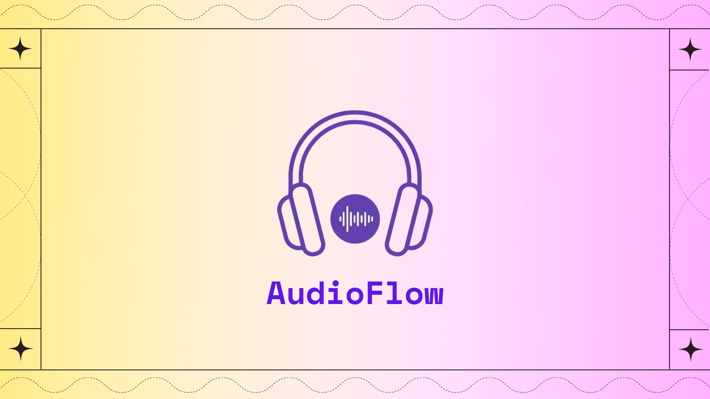

## Introduction

This proof of concept uses Lens Protocol to allow users to create their profile (if they dont have any), post audio files as lens publications and also donate tokens to users by using superfluid protocol. The audio content is uploaded to IPFS by using web3.storage api and also the user ipfs node in his browser.

## How it works

- User login in the dapp using his wallet and connect to the lens protocol;
- If he has not a lens profile, he will be allowed to create one at "Profile" page;
- Once user publish a content this is uploaded to IPFS by using web3.storage api, which will allow that content to be pined by other ipfs nodes by using filecoin;
- Users can explore others music posts in the "Explore" page, where they can donate to the publication owners by streaming tokens using superfluid protocol;

# Features

- Streaming of revenue to the author of song
- SignIn with Lens
- Connect with web3 wallet
- Create publication
- Explore content on lens
- Create lens profile
- Upload and save data to IPFS

# Implementation

We used ConnectKit for connecting wallets. It allows us to connect using WalletConnect, Metamask and other wallets. For the frontend we used Create-React-App and added tailwind css for styling. We connected the app to lens protocol and allowed users to signin with lens, create profiles, and make publications. We use Apollo client for fetching data and making mutations to the lens protocol. For streaming of revenue to authors of a song we use SuperFluid and the app lives on the polygon mumbai blockchain. For storage of metadata we use IPFS.

# Demo
